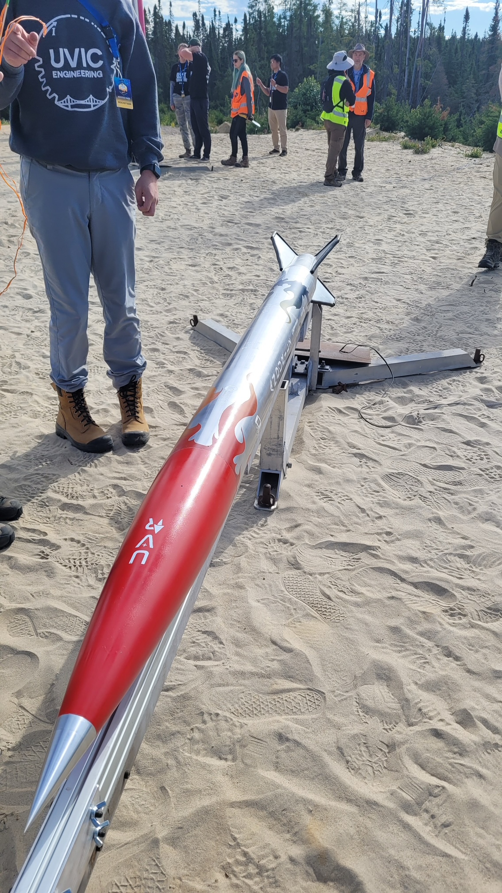
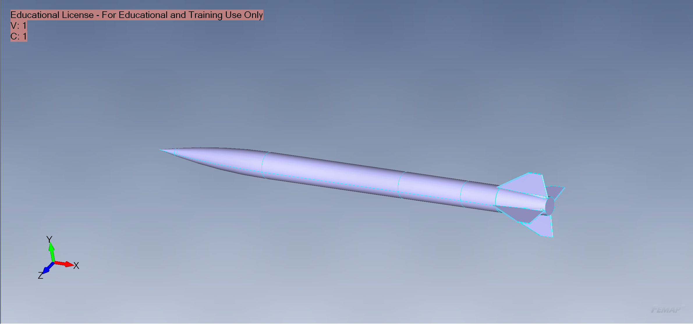
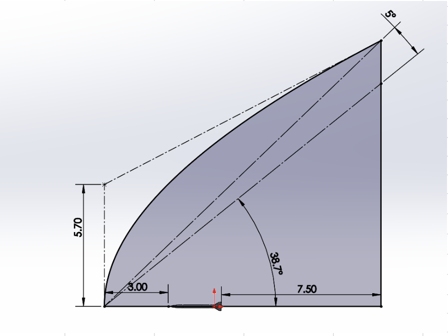
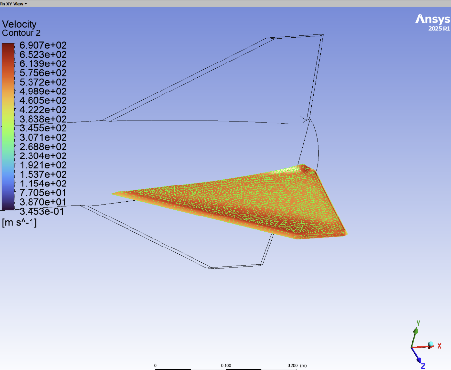
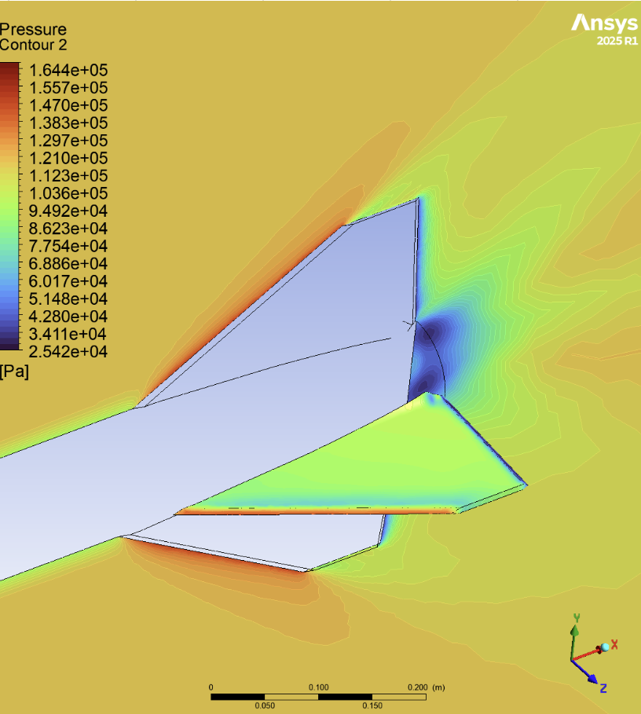
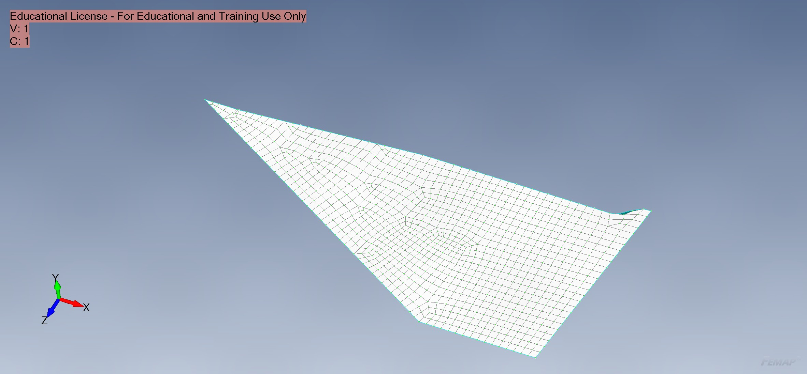
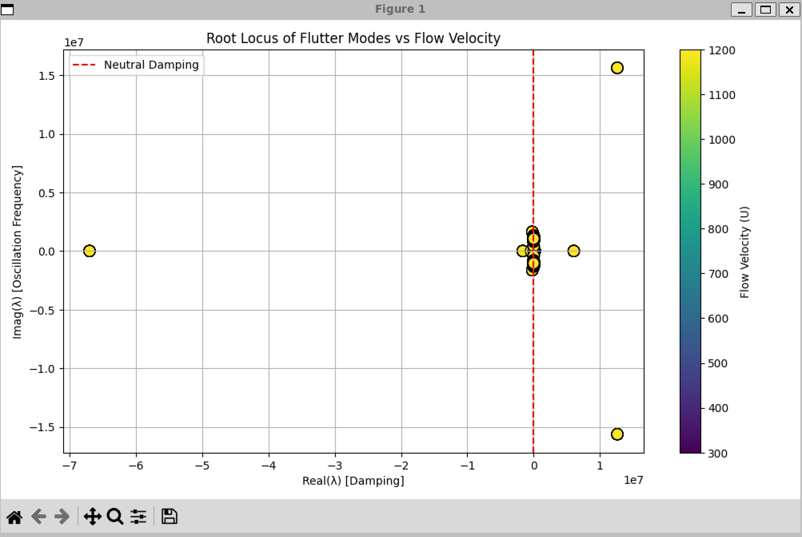
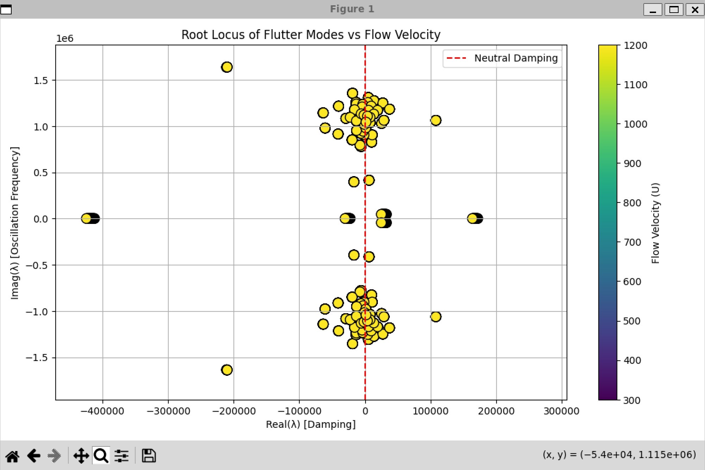
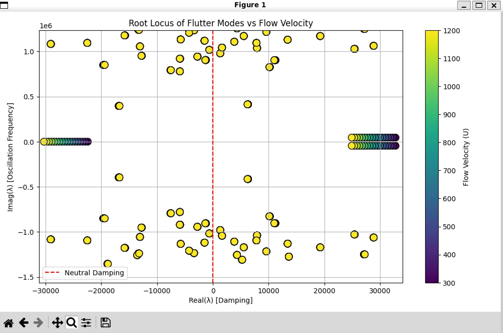

Note: I definitely did something wrong here, the frequencies seem OOM off of what they should be so the result is garbage out :(. Hopefully I can fix this sometime soon, but my focus right now is on designing a rocket engine here: https://github.com/rwright403/king_hybrid

Note: this program currently exists unvalidated. Proceed with extreme caution 

# rocket-flutter-speed-analysis 🚀

Created for UVic Rocketry https://onlineacademiccommunity.uvic.ca/rocketry/rockets/ :)

While NACA 4917 is commonly and successfully used for student rocketry, it is based on empirical data and is only valid for fins made of isotropic fins.
Even though the rocket this program was built for has aluminum plate fins, this program was designed as a first pass method that could be modified to be capable of finding the flutter speed of composite fins for future rockets.

To address this need, a loosely coupled flutter speed calculator was built using open-source and software available to students (from a student license).
It is a direct implementation of the method described by [5] (see below) where flutter is solved with the state-space method and an aerodynamic model is built with the local piston theory.

There are definitely some future improvements for this program however, I am happy with the progress I have made so far so I will list the possible improvements here:
- Program poorly handles any node that does not have exactly 6 dof and cannot handle any element types other than CQUAD4
- Program definitely requires more validation work to get a true understanding of the limitations and error
- Could look into building multiple aero matrices A and B instead of relying on one sweep where flow results are linear wrt A and B

## Running this program:
This file takes input in the form of a python module file. 

In the directory this file is in:  #python3 -m src <filename of a desired python module file without the .py>

The inputs folder contains the input files where the user can update the inputs the program uses.


## Required Program Inputs:
(the location of these files must be specified in the python module)

### Harmonics Simulation - from ALTAIR OPTISTRUCT NASTRAN:
The following data from ALTAIR OPTISTRUCT in the following NASTRAN Format:

#### .OP2 Outputs:
- mode shapes

### Structual Model - from ALTAIR OPTISTRUCT NASTRAN:
The model global mass and stiffness matrices from ALTAIR OPTISTRUCT in the following NASTRAN Format:

#### .pch file 
- Node and Element definitions

#### .full.mat (Altair Hyperworks) Outputs:
- Global Mass Matrix
- Global Stiffness Matrix
- Grid-to-DOF Mapping Matrix

To obtain the required output in the .full.mat file, put the following lines above case ctrl:
   | FORMAT = OP2
   | OUTPUT,MATRIX,FULL,SPARSE 

### CFD:
The following freestream and local (at NASTRAN element centroids) flow data:
- pressure (p)
- density (rho)
- speed of sound (a) 
- flow velocity (U)

Originally designed to parse OpenFOAM and follow the method presented in [8], ended up getting a friend to run Ansys CFX for me and used his results. (Thank you Gordon!)

# Documentation

## Project Goal:
Given a supersonic rocket with chosen fin dimensions, solve the divergence and flutter speed.
### Guiding Tenant:
Want to prioritize speed of completing this program for our specific sounding rocket case over building a general flutter solver. 

## Workflow Notes

1) Review of current flutter prediction methods used on student rocketry teams:
- Did not find much beyond NACA 4917

2) Initially tried to use NASTRAN:
- MSC NASTRAN did not have flutter accessible in the student version
- Altair Hypermesh (NASTRAN) had a flutter solver, but did not have a supersonic aero model available

3) Therefore we need to work at a lower level and build the flutter solver ourselves: 
New approach "weakly coupled solver" - using [5] as a guide.
This method requires a Harmonics and a CFD Simulation

4) The following thoughts shaped our approach
- Altair Hypermesh (NASTRAN) student license allows us to solve for some things we need.
- There are already built python libraries for working with NASTRAN output files.
- Can use the method in [5] to build our aerodynamic model.
- under our recurring tenent, we only need to solve flutter speed for our specific case. We can write a program that is very specific to our rocket fin and make decisions surrounding model settup that will simplify this program.


## Aerodynamic Model ✈️ (See [5]) and Interpolation ➰
Unsteady Aerodynamic Model created with local piston theory and steady CFD results from method in [5]

First Try: First Order Local Piston Theory, from [5] looks like we will likely want second order model as best balance between accuracy and complicatedness

### Assumptions:
- Small peturbations and deflections
- thin airfoil

### Implementation:
To simplify the interpolation between the aero model and the mass model, CQUAD4 elements are used to define "aero panels" where the aero force is taken at the centroid
- This will simplify the interpolation of unsteady aero force to the grid points

For element normal vectors and deflections, taken at element level. Need to solve aero at element node center and interpolate to structural model
- We can likely use this library https://docs.pyvista.org/examples/01-filter/interpolate
Note!!!! we are interpolating unsteady force --> complex numbers and vectors. 
This cannot interpolate complex numbers directly, but we can split and interpolate real and complex parts separately.


## Solver 📝 and Postprocessing 🛠️🐍
Since we only care about flutter speed (not capturing any behavior after flutter point), solve problem in frequency domain as per [5]
This results in a simple root loci eigenvalue problem that can be easily solved with an already built library.


## Validation ✅

As of writing, this program has not been validated against real data. I would like to come back to this when I have some time:

See [4], [21]
Potentially See [3] - seems to use piston theory
[1] also has examples


## Sources and Citations:


| Number | Source                            | Contribution / Use Description                 | Link to Source    |
|--------|-----------------------------------|------------------------------------------------|-------------------|
| [1]    | Wright and Cooper Aeroelasticity Textbook | Starting point for learning theory     |                   |
| [2]    | AEROELASTIC INVESTIGATION OF A MISSILE CONFIGURATION | Example of MSC Nastran for flutter analysis of a similar vehicle                   | https://www.foi.se/rest-api/report/FOI-R--0474--SE |
| [3]    | EXPERIMENTAL AND CALCULATED RESULTS OF SUPERSONIC FLUTTER CHARACTERISTICS OF A LOW ASPECT-RATIO FLAT-PLATE SURFACES | Looks Promising for a validation case, no body just fin | https://arc.aiaa.org/doi/10.2514/6.1967-1340 |
| [4]    | A Sensitivity Investigation on the Aeroelastic Dynamic Stability of Slender Spinning Sounding Rockets | shows nastran model setup and validation, basically what we want to do | doi: 10.5028/jatm.v5i1.192 |
| [5]    | Supersonic Flutter Analysis Based on a Local Piston Theory | This paper presents the method we will try to use | https://www.researchgate.net/publication/245426315_Supersonic_Flutter_Analysis_Based_on_a_Local_Piston_Theory |
| [6]    | Piston Theory-A New Aerodynamic Tool for the Aeroelastician | used to understand some of the aero theory in [5] | https://arc.aiaa.org/doi/abs/10.2514/8.3740?journalCode=jans |
| [7]    | Ata engineering flutter tutorial | useful overview | https://www.youtube.com/watch?v=GjBXsR6SSLY&t=165s |
| [8]    | Toolchain for Aerodynamic Characterization of a Rocket During Ascent using OpenFOAM | OpenFOAM toolchain the cfd in this project is built on |https://github.com/WyllDuck/OpenFOAM-ToolChain-for-Rocket-Aerodynamic-Analysis |
| [9]    | OpenFOAM-ToolChain-helperFunctions | Helper functions from the same author as [8] for the toolchain | https://github.com/WyllDuck/OpenFOAM-ToolChain-helperFunctions/tree/30bf81273756a84d419085d8e594a9b08d46e7dd |
| [10]   | Docker instructions for [8],[9] | Setup CFD Toolkit | https://github.com/jakobhaervig/openfoam-dockerfiles |
| [11]   | OS-T: 1110 Modal Analysis Setup | Altair Modal Analysis Setup |https://2021.help.altair.com/2021/hwsolvers/os/topics/solvers/os/modal_analysis_setup_r.htm
| [12]   | Altair community fourum "How do i export stiffness and mass matrices from Optistruct?" | | https://community.altair.com/discussion/25732/how-do-i-export-stiffness-and-mass-matrices-from-optistruct|
| [13]   | .mat file format | used to reference for parser |https://2021.help.altair.com/2021/hwsolvers/os/topics/solvers/os/full_mat_file_r.htm |
| [14]   | NASA turbmodels ONERA M6 Wing  | for CFD setup lessons learned | https://turbmodels.larc.nasa.gov/onerawingnumerics_val.html |
| [15]   | YT lecture: [CFD] The k - omega SST Turbulence Model | Used to understand turbulence model | https://www.youtube.com/watch?v=myv-ityFnS4 |
| [16]   | OpenFOAM k-omegasst User Guide | for init | https://www.openfoam.com/documentation/guides/latest/doc/guide-turbulence-ras-k-omega-sst.html | 
| [17]   | An Approximate True Damping Solution of the Flutter Equation by Determinant Iteration by Hermann J. Hassig | Understanding the p-k method | https://doi.org/10.2514/3.44311 |
| [18]   | Implementation of a Solver for Static Aeroelasticity and Flutter Prediction on Light Sport Aircrafts based on VLM, DLM and advanced 1D structural models  | Another look at the p-k method/implementation| http://webthesis.biblio.polito.it/id/eprint/22261 |
| [19]   | Flutter Calculation Methods | | https://link.springer.com/content/pdf/10.1007/978-981-16-8078-6_9 |
| [20]   | Altair Full Mat File | ref for dof mapping | https://2021.help.altair.com/2021/hwsolvers/os/topics/solvers/os/full_mat_file_r.htm |
| [21]   | NACA 4917 | Presents a simple flutter criterion | https://ntrs.nasa.gov/citations/19930085030 |

Note: p-k method not used, just briefly considered and explored

<!-- Using a virtual environment to stop this from interfering w other python projects:
Enter virtual env with 
> source venv/bin/activate
Exit with - deactivate -->

# Verbose 🗣️🗣️🗣️

## UVic Rocketry Anduril-2 Information:



The team's 9th competition rocket. Building off of the success of the first supersonic rocket Anduril-1 built the year before.
Flew at the 2025 Launch Canada Competition. Unfortunately something odd happened during recovery and its fuselage currently lies somewhere in a field in rural Ontario. We found the nosecone though.

### Dimensions:

- Fuselage outer diameter: 5.75 in
- Total rocket length: 97.64 in
- Fin count: 4
- Fins attached to boat tail with Loctite EA E-120-HP Epoxy
- Span: 5 in
- Root chord: 13 in
- Tip chord: 3.5 in
- Sweep distance: 8.5 in
- Fin thickness: 0.255 in
- Maximum expected speed of Mach 1.6

### Anduril-2 Flutter Analysis:

Unfortunately this was done quickly before competition, so we skipped a lot of the validation steps that should exist in the workflow. We definitely acknowledge this, and do not guarantee completeness or accuracy of the results presented. These results should therefore be seen as an initial run/first pass.
Despite this, we learned a lot about flutter modelling through this project, and I believe already in its current state it is progress in flutter prediction on student rocketry teams. 



The UVR Analysis and Structures team created the OML based on mission requirements, reduced order trajectory models and manufacturability contraints.




From this geometry, a CFD simulation was performed and a FEM was created. We assumed the deflection at the root is so minimal it can be neglected, so we only made an fem of the fin and treated it as fixed at the root.

Massive thanks to Gordon So for helping me setup and run the CFD!



For our flutter analysis, we looked at 0, 2.5 and 5 degree AOA cases. The results of the 0 degree AOA case are presented above.



We preformed a sol 103 Harmonic simulation in Altair Optistruct on the model above (Built in Simcenter FEMAP because I prefer the UI more). 100 modes were arbitrarily requested.

For this case, the program produced a root locus plot of the modes.


Full frame

Partial Zoom

Detail Zoom

From these results, we do not see any mode coupling, or any modes that are unstable in the velocities we swept.

Just to make it clear, we would need to do a lot more work to validate some of the following items:
- If aero can really be treated as linear with velocity in the range of our sweep
- How many modes we need to include
- the fixed root assumption
- the accuracy/error of the program

Despite this, I am happy with the amount of learning I achieved through making this program, I am going to set it aside for now and I will try to come back to it at some point.

## Next Steps:
- More validation work
- It would be very easy to leverage Altair Optistruct to model fin flutter on composite plate fins. At this stage I believe the only addition would be some calculator to get the composite fin torision axis.

```
                                               _______
       UVic Rocketry Fin Flutter Solver       /       \~
                                             /         \~
____________________________________________/           \~
```
