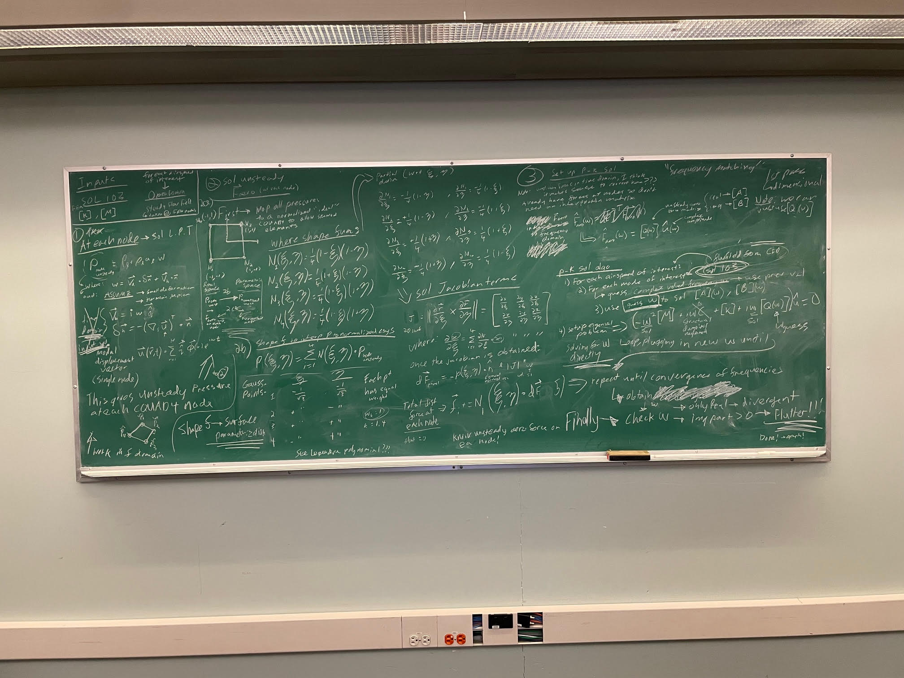

# rocket-flutter-speed-analysis 🚀
A loosely coupled flutter speed calculator built using open-source and software available to students (from a student license).
Based on the method created by [5]. Created for UVic Rocketry https://onlineacademiccommunity.uvic.ca/rocketry/rockets/ :)

## Running this program:
This file takes input in the form of a python module file. 

In the directory this file is in:  #python3 -m src <filename of a desired python module file without the .py>

The inputs folder contains the input files where the user can update the inputs the program uses.

## Required Program Inputs:

### Harmonics Simulation - from ALTAIR OPTISTRUCT NASTRAN:
The following data from ALTAIR OPTISTRUCT in the following NASTRAN Format:

To obtain the required output files, put the following lines above case ctrl:
   | FORMAT = OP2
   | OUTPUT,MATRIX,FULL,SPARSE 

#### .OP2 Outputs:
- natural frequencies
- mode shapes

(below are nice to have but can be solved for internally if needed)
- element centroids
- element normal vectors
- element areas

### Structual Model - from ALTAIR OPTISTRUCT NASTRAN:
The model global mass and stiffness matrices from ALTAIR OPTISTRUCT in the following NASTRAN Format:

#### .mat (Altair Hyperworks) Outputs:
- Global Mass Matrix
- Global Stiffness Matrix
   - Order of nodes along matrix diagonals ?

### CFD - from Openfoam:
The following freestream and local (at NASTRAN element centroids) flow data:
- pressure (p)
- density (rho)
- speed of sound (a) 
- flow velocity (U)

Try to use OPENFOAM Sampling (postprocessing) tool to get flow data at NASTRAN element centroids https://www.openfoam.com/documentation/guides/latest/doc/guide-fos-sampling-sets.html

#### Right now program just takes a series of openfoam input files. In a future iteration of the program, should nondimensionalize all aero and allow the user to create and interpolate from a database to use fewer cfd runs.
I am just setting up a MVP version of this program because of a time constraint I am under and because I am learning aeroelasticity.

# Documentation

## Project Goal:
Given a supersonic rocket with chosen fin dimensions, solve the divergence and flutter speed.
### Guiding Tenant:
Want to prioritize speed of completing this program for our specific sounding rocket case over building a general flutter solver. 

## Workflow Notes

1) Initially tried to use NASTRAN:
- MSC NASTRAN did not have flutter accessible in the student version
- Altair Hypermesh (NASTRAN) did not have a supersonic aero model available

2) Therefore we need to work at a lower level and build the flutter solver ourselves: 
New approach "weakly coupled solver" - using [5] as a guide.
This method requires a Harmonics and a CFD Simulation

3) The following thoughts shaped our approach
- Altair Hypermesh (NASTRAN) student license allows us to solve for some things we need.
- There are already built python libraries for working with NASTRAN output files.
- Can use [5] to build our aerodynamic model.
- under our recurring tenent, we only need to solve flutter speed, (do not need a general solver to solve past flutter speed. This simplifies analysis and lets us solve in the frequency domain)

## Aerodynamic Model ✈️  (See [5]) and Interpolation ➰
Unsteady Aerodynamic Model created with local piston theory and steady CFD results from method in [5]

First Try: First Order Local Piston Theory, from [5] looks like we will likely want second order model as best balance between accuracy and complicatedness

### Assumptions:
- Small peturbations and deflections
- thin airfoil

### Implementation:
To simplify the interpolation between the aero model and the mass model, CQUAD4 elements are used to define "aero panels" where the aero force is taken at the centroid
- This will simplify the interpolation of unsteady aero force to the grid points

Need to interpolate the aero force from the element centroids to the locations of the structural element nodes. 

For element normal vectors and deflections, taken at element level. Need to solve aero at element node center and interpolate to structural model
- We can likely use this library https://docs.pyvista.org/examples/01-filter/interpolate
Note!!!! we are interpolating unsteady force --> complex numbers and vectors. 
This cannot interpolate complex numbers directly, but we can split and interpolate real and complex parts separately.

#### Blackboard:

## Solver 📝 and Postprocessing 🛠️🐍
Since we only care about flutter speed (not capturing any behavior after flutter point), solve problem in frequency domain as per [5]
This results in a simple root loci eigenvalue problem that can be easily solved with an already built library.

Depending on the sign of the imaginary part of the eigenvalue, can predict if flutter will occur.
I think the sign on the real part can also be used to predict divergence as well --> TODO read more.

## Validation ✅

See [4]

Potentially See [3] - seems to use piston theory

[1] also has examples
TODO: try first tutorial to build an understanding of how all the pieces fit together

## Other Assumptions and Notes 📝
- want to recreate experimental data to validate our understanding/methods
- likely want to do a mesh convergence study on model
- temperature effects? - probably out of scope given ideal timeline but an understanding of the level of impact and how that would impact the flutter speed would be useful

## Sources and Citations:

| Number | Source                            | Contribution / Use Description                 | Link to Source    |
|--------|-----------------------------------|------------------------------------------------|-------------------|
| [1]    | Wright and Cooper Aeroelasticity Textbook | Starting point for learning theory     |                   |
| [2]    | AEROELASTIC INVESTIGATION OF A MISSILE CONFIGURATION | Example of MSC Nastran for flutter analysis of a similar vehicle                   | https://www.foi.se/rest-api/report/FOI-R--0474--SE |
| [3]    | EXPERIMENTAL AND CALCULATED RESULTS OF SUPERSONIC FLUTTER CHARACTERISTICS OF A LOW ASPECT-RATIO FLAT-PLATE SURFACES | Looks Promising for a validation case, no body just fin | https://arc.aiaa.org/doi/10.2514/6.1967-1340 |
| [4]    | A Sensitivity Investigation on the Aeroelastic Dynamic Stability of Slender Spinning Sounding Rockets | shows nastran model setup and validation, basically what we want to do | doi: 10.5028/jatm.v5i1.192 |
| [5]    | Supersonic Flutter Analysis Based on a Local Piston Theory | This paper presents the method we will try to use | https://www.researchgate.net/publication/245426315_Supersonic_Flutter_Analysis_Based_on_a_Local_Piston_Theory |
| [6]    | Piston Theory-A New Aerodynamic Tool for the Aeroelastician | used to understand some of the aero theory in [5] | https://arc.aiaa.org/doi/abs/10.2514/8.3740?journalCode=jans |
| [7]    | Ata engineering flutter tutorial | useful overview | https://www.youtube.com/watch?v=GjBXsR6SSLY&t=165s |
| [8]    | Toolchain for Aerodynamic Characterization of a Rocket During Ascent using OpenFOAM | OpenFOAM toolchain the cfd in this project is built on |https://github.com/WyllDuck/OpenFOAM-ToolChain-for-Rocket-Aerodynamic-Analysis |
| [9]    | OpenFOAM-ToolChain-helperFunctions | Helper functions from the same author as [8] for the toolchain | https://github.com/WyllDuck/OpenFOAM-ToolChain-helperFunctions/tree/30bf81273756a84d419085d8e594a9b08d46e7dd |
| [10]   | Docker instructions for [8],[9] | Setup CFD Toolkit | https://github.com/jakobhaervig/openfoam-dockerfiles |
| [11]   | OS-T: 1110 Modal Analysis Setup | Altair Modal Analysis Setup |https://2021.help.altair.com/2021/hwsolvers/os/topics/solvers/os/modal_analysis_setup_r.htm
| [12]   | Altair community fourum "How do i export stiffness and mass matrices from Optistruct?" | | https://community.altair.com/discussion/25732/how-do-i-export-stiffness-and-mass-matrices-from-optistruct|
| [13]   | .mat file format | used to reference for parser |https://2021.help.altair.com/2021/hwsolvers/os/topics/solvers/os/full_mat_file_r.htm |

<!-- Using a virtual environment to stop this from interfering w other python projects:
Enter virtual env with 
> source venv/bin/activate
Exit with - deactivate -->

## UVic Rocketry Anduril-2 Information:
1) Dimensions:

   Fuselage outer diameter: 5.75 in
   Total rocket length: 97.64 in
   Span: 5 in
   Root chord: 13 in
   Tip chord: 3.5 in
   Sweep distance: 8.5 in
   Fin thickness: 0.255 in
   Fin count: 4
   

L/D ratio: 12?

Fin shape:
Trapezoidal profile w/ hexagonal airfoil

Fin attachment to fuselage/boat tail:
Loctite EA E-120-HP Epoxy

2) Flight Profile:

Velocity

### Fuselage and Nosecone 
???
can we treat as rigid?

### Fin 
is being loaded in:
- Out of plane bending
- Torision
- Shear

Assuming small deformations (linear) to start

<!-- modal superposition formula det. if useful https://docs.software.vt.edu/abaqusv2023/English/SIMACAEGSARefMap/simagsa-c-dynmodsuperpos.htm -->

<!-- This is a comment in a Markdown file (not rendered) --> 
